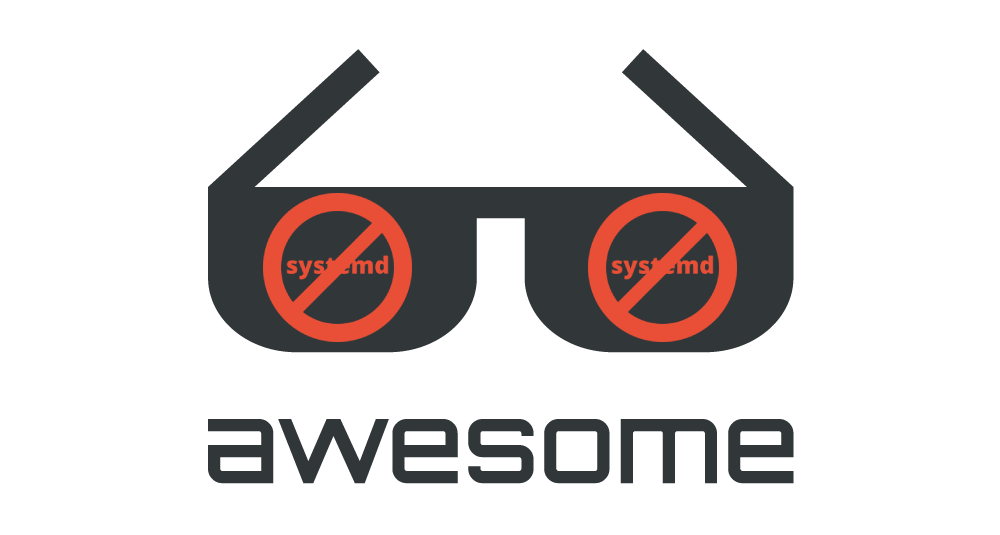

  

# Awesome Anti-Systemd  

## Init Systems and Process Supervisors
* [sysvinit](https://wiki.gentoo.org/wiki/Sysvinit) - the original init
* [OpenRC](https://wiki.gentoo.org/wiki/OpenRC) - a dependency-based init system
  * [openrc-init](https://wiki.gentoo.org/wiki/OpenRC/openrc-init) - a sysvinit replacement
* [s6](https://www.skarnet.org/software/s6) - a daemontools-inspired process supervisor
  * [s6-linux-init](https://skarnet.org/software/s6-linux-init/) - s6-based Linux init system
  * [s6-rc](https://skarnet.org/software/s6-rc/) - service manager
  * [s6-overlay](https://github.com/just-containers/s6-overlay) - integrates s6 with Docker images
  * [66-tools](https://web.obarun.org/software/66-tools/) - a suite of s6 helpers made by the creators of the Obarun distribution
* [runit](http://smarden.org/runit/) - a minimalistic daemontools-inspired process supervisor
* [Upstart](https://wiki.ubuntu.com/Upstart) - an init replacement for sysvinit made by Canonical
* [GNU Shepherd](https://www.gnu.org/software/shepherd/) - init system and service manager made by GNU, intended for [GNU/Hurd](https://www.gnu.org/software/hurd/) and [GNU/Guix](https://guix.gnu.org/index.html)

## Distros

Linux distributions that offer alternatives to systemd.

### Debian-based
* [Devuan](https://devuan.org/)

### Gentoo-based
* [Gentoo](https://www.gentoo.org/)
  * Gentoo currently supports systemd and openrc
* [Funtoo](https://www.funtoo.org/Welcome)
  * Funtoo does not plan on supporting systemd and actively avoids it [Link](https://www.funtoo.org/Mitigating_Systemd)

### Arch-based
* [Artix](https://artixlinux.org/)
  * Supports OpenRC, runit and s6
* [Obarun](https://web.obarun.org/)
  * Supports s6, along with their own s6 wrapper, 66-tools, that provides a systemd-like experience
* [Parabola](https://www.parabola.nu/)
* [Hyperbola](https://www.hyperbola.info/)

### Other
* [Void](https://voidlinux.org/)
* [Guix](https://guix.gnu.org/)
* [Alpine](https://www.alpinelinux.org/)
* [Slackware](http://www.slackware.com/)

## Articles
* [systemd, 10 years later: a historical and technical retrospective](https://blog.darknedgy.net/technology/2020/05/02/0/index.html)
* [Comparison of init systems](https://wiki.gentoo.org/wiki/Comparison_of_init_systems)
* [suckless](https://suckless.org/sucks/systemd/)
* [Where I stand on Systemd](https://fossforce.com/2020/02/where-i-stand-on-systemd/)

## Repositories
* https://github.com/dantrell/gentoo-project-gnome-without-systemd

## Websites

* [nosystemd.org](https://nosystemd.org/)

